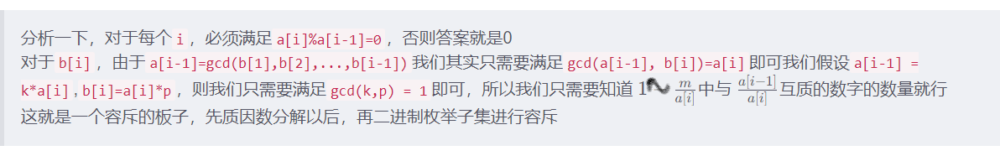

# Count GCD

知识点涉及：gcd，容斥原理、质因子

## 题解

[CodeTON Round 3 (Div. 1 + Div. 2, Rated, Prizes) 「D. Count GCD gcd+容斥」_Chels.的博客-CSDN博客](https://blog.csdn.net/weixin_51216553/article/details/127736477)

[CodeTON Round 3 (Div. 1 + Div. 2, Rated, Prizes!) A - E - 知乎 (zhihu.com)](https://zhuanlan.zhihu.com/p/581011028)



## 个人题解

不存在：a[i]%a[i-1]!=0,

存在：每次只用看a[i]和a[i-1]即可，要满足`a[i-1] = k*a[i]`,`b[i]=a[i]*p`，p和k互质，只需要知道1− m/a[i] 中与 a [i−1] /a [i] 互质的个数即可

算法：容斥，加质因子求解（1e9质因子不会超过10个）

```C++
vector<int>prim;
int Rh(int q,int x){
	//求解x的质因子
	prim.clear();
	for(int i=2;i<=sqrt(x);++i){
		if(x%i==0){
			prim.emplace_back(i);
			while(x%i==0)x/=i;
		}
	}
	if(x>1)prim.emplace_back(x);//自己也可以组合
	int sum=0;
	int cnt=0;int now=1;
	for(int i=1;i<(1<<prim.size());++i){//i从1开始，必须不能是空的
		cnt=0;now=1;//now至少要1
		for(int j=0;j<prim.size();++j){
			if(i&(1<<j)){
				now=now*prim[j];cnt++;
			}
		}
		if(cnt&1)sum+=q/now;
		else sum-=q/now;
	}
	return q-sum;
}
```

## 容斥板子

[算法题解之容斥原理_carson0408的博客-CSDN博客_容斥原理算法](https://blog.csdn.net/carson0408/article/details/79268208?ops_request_misc=%257B%2522request%255Fid%2522%253A%2522166842813416800182720122%2522%252C%2522scm%2522%253A%252220140713.130102334..%2522%257D&request_id=166842813416800182720122&biz_id=0&utm_medium=distribute.pc_search_result.none-task-blog-2~all~sobaiduend~default-1-79268208-null-null.142^v63^pc_rank_34_queryrelevant25,201^v3^add_ask,213^v2^t3_esquery_v2&utm_term=%E5%AE%B9%E6%96%A5%E7%AE%97%E6%B3%95&spm=1018.2226.3001.4187)

```C++
ll count_prime(ll n,ll x){
    pme.clear();
    for(ll i=2;i<=sqrt(x);++i){//求解质因子
        if(x%i==0){
            pme.push_back(i);
            while(x%i==0) x/=i;
        }
    }
    if(x>1) pme.push_back(x);
    ll sum=0;
    for(int i=1;i<(1<<pme.size());++i){//二进制枚举，
        ll z=1,num=0;
        for(int j=0;j<pme.size();++j)
            if(i>>j&1) {z*=pme[j];++num;}
        if(num&1) sum+=n/z;//全部算出
        else sum-=n/z;//删去没用的内容
    }
    return n-sum;
}
```


