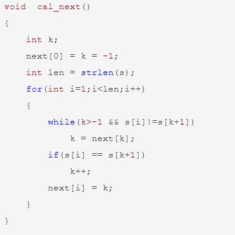

# kmp循环节

## 知识讲解

参考：[KMP算法中的循环节问题__Warning_的博客-CSDN博客](https://blog.csdn.net/destiny1507/article/details/81588116)

但请个人总结为主，因为nex数组不一样。

### 完全循环

   对于一个具有循环节并且长为n的字符串，其循环节长为 n - n x t [ n - 1 ] ，并且满足n % ( n - n x t [ n - 1 ] ) ==0 , 这里nxt [ ]是KMP算法中的next 数组。
（不同的构造方法可能式子不一样，比如有的方法下可能是 n - n x t [ n ] ）

### 不完全循环

   不完全循环是说需要补上一些位才能构成完整的循环，比如abca，就可以称为一个不完全循环，需要补上bc才能构成一个完整的循环。而完全循环则是类似abcabc这样的。设字符串长度为 len ，那循环节长度就是 len-nxt [len-1]，需要补全的位数就是循环节长度-nxt [ len-1 ]%循环节长度。

### 证明

其实写出一个字符串模拟一下就能感觉到。

   比如给出字符串：abcdabcdabcd，长度为12，而我们 nxt [ 12-1 ] = nxt [ 11 ] = 8，根据这个nxt数组的定义，它表示的是这个字符串前缀和后缀相等的最大长度，如果是完全循环，那么剩下的也就是 len-nxt [ 11 ]当然就是最大的循环节长度了。
 
   如果把字符串改为：abcdefabc，我们可以知道，循环节算的方法跟完全循环的一样，就是len - nxt [ len-1 ]=L，即abcdef，那么 nxt [ len-1 ] 就是最后剩下的一串字符，它可能大于循环节也可能小于循环节（大于循环节的时候：len - nxt [ len-1 ] < nxt [ len-1 ]，即 2 * nxt [ len-1 ] > len，比如azaza的情况）因此我们要用nxt [len-1] %循环节长度表示剩下的，而需要补全的当然就是循环节长度减去这个值啦。

## 个人总结：

大致总结一下：循环节的长度：L=len-nex[len]（不同代码，不同表示）（从1开始的字符串

有两个分类：

完全循环，循环节个数len/L

不完全循环：需补全的个数L-len%L=L-（len-L）%L=L-next[len]%L，

主要在这个照片：


## 代码实现




一道例题：[M-循环节_集美大学第九届程序设计竞赛（同步赛） (nowcoder.com)](https://ac.nowcoder.com/acm/contest/42400/M)

队友的代码：

```C++
#include<bits/stdc++.h>
using namespace std;
const int MAXN = 1e6 + 10;
char s[MAXN];
int b[MAXN];
int ne[MAXN];
int main()
{
	int n, m;
	scanf("%d%d", &n, &m);
	for(int i = 1; i <= n; i ++ ) cin >> s[i];
	ne[0] = -1;
	for(int i = 2, j = 0; i <= n; i ++ )//nex数组的建立
	{
		while(j && s[i] != s[j + 1]) j = ne[j];
		if(s[i] == s[j + 1]) j ++;
		ne[i] = j;
	//	cout << ne[i] << endl;
	}
	
	int st = n - ne[n];//循环节长度，本题是完全循环
//	cout << st << endl;
	for(int now = st; now <= n; now += st )
	{
		b[now] ++;
	} 
	while( m -- )
	{
		int l, r;
		scanf("%d%d", &l, &r);
      	 l++;r++;
		if(b[r] && (n % (r - l + 1) == 0) && ((r - l + 1) % st == 0)) puts("YES");
		else puts("NO");
	}
}
```

