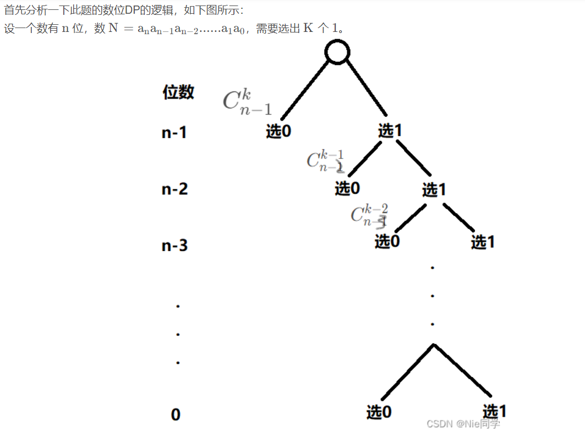
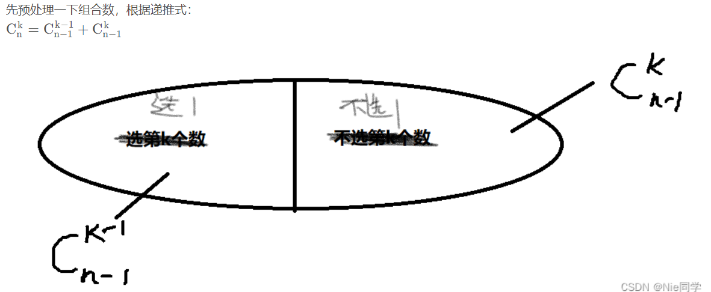
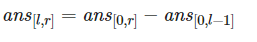

# 二进制问题

涉及知识点：数位dp

题目链接：[P8764 [蓝桥杯 2021 国 BC\] 二进制问题 - 洛谷 | 计算机科学教育新生态 (luogu.com.cn)](https://www.luogu.com.cn/problem/P8764)

## 题目概述

### 题目描述

小蓝最近在学习二进制。他想知道 1 到 N 中有多少个数满足其二进制表示中恰好有 K 个 `1`。你能帮助他吗?

### 输入格式

输入一行包含两个整数 N 和 K。

### 输出格式

输出一个整数表示答案。

### 输入输出样例

输入 #1

```
7 2
```

输出 #1

```
3
```

###说明/提示

对于 30% 的评测用例, 1≤N≤106,1≤K≤10 。

对于60% 的评测用例, 1≤N≤2×109,1≤K≤30 。

对于所有评测用例,1≤N≤1018,1≤K≤50 。

蓝桥杯 2021 国赛 B 组 H 题（C 组 J 题）。

## 题解

参考：[蓝桥杯2021年第十二届国赛真题-二进制问题_Nie同学的博客-CSDN博客_蓝桥杯国赛题目](https://blog.csdn.net/qq_46117575/article/details/125081583)

非常明显这道题目是典型的数位DP的题目，题干说到在某个区间，求满足某种条件的数的个数，即这道题可以用数位DP过掉，再分析一下时间复杂度，其数据范围在10 ^18
 上，从这里可以推断出时间复杂度大概率应该控制在O(log(n))，此时数位DP正好可以将此题AC掉！还需注意的一点是此题会爆int，应该用long。

首先分析一下此题的数位DP的逻辑，如下图所示：


先预处理一下组合数，根据递推式：


## 个人理解：

### 内容:

运用数位dp，从高位到低位，若当前位选0，小的位可以选k-已选1的个数；若当前位选1，则已选1的个数++；

数组记录答案。

### 数位dp

```C++
int dp(int n,int k){
    int ans=0;//记载答案
    int cnt=0;//记载已选1的个数
    vector<int>ve;
    while(n){//变位二进制位
        ve.emplace_back(n%2);
        n/=2;
    }
    for(int i=ve.size()-1;i>=0;--i){
        if(ve[i]){
            ans+=f[i][k-cnt];//左树已经预处理过
            cnt++;
            if(cnt>k)break;//用1太多了
        }
        if(i==0&&cnt==k)ans++;//别漏情况
    }
    return ans;
}
```


### 组合数

```c++
int f[100][100];//要开long long
void init(){
    for(int i=0;i<60;++i){
        for(int j=0;j<=i;++j){
            if(!j)f[i][j]=1;
            else f[i][j]=f[i-1][j-1]+f[i-1][j];
        }
    }
}
```


### 总体代码：

```C++
int f[100][100];//要开long long
void init(){
    for(int i=0;i<60;++i){
        for(int j=0;j<=i;++j){
            if(!j)f[i][j]=1;
            else f[i][j]=f[i-1][j-1]+f[i-1][j];
        }
    }
}
int dp(int n,int k){
    int ans=0;//记载答案
    int cnt=0;//记载已选1的个数
    vector<int>ve;
    while(n){//变位二进制位
        ve.emplace_back(n%2);
        n/=2;
    }
    for(int i=ve.size()-1;i>=0;--i){
        if(ve[i]){
            ans+=f[i][k-cnt];//左树已经预处理过
            cnt++;
            if(cnt>k)break;//用1太多了
        }
        if(i==0&&cnt==k)ans++;//别漏情况
    }
    return ans;
}
void solve(){
    //数位DP
    int n,k;
    cin>>n>>k;
    init();
    cout<<dp(n,k)<<'\n';
}   
```

## 数位DP

### 参考文章：

[数位DP学习整理（数位DP看完这篇你就会了）_unique_pursuit的博客-CSDN博客_数位dp](https://blog.csdn.net/hzf0701/article/details/116717851)

[数位 DP - OI Wiki (oi-wiki.org)](https://oi-wiki.org/dp/number/)

### 适用情况：

一般具有这几个特征：

1. 要求统计满足一定条件的数的数量（即，最终目的为计数）；
2. 这些条件经过转化后可以使用「数位」的思想去理解和判断；
3. 输入会提供一个数字区间（有时也只提供上界）来作为统计的限制；
4. 上界很大（比如 ），暴力枚举验证会超时。

### 基本思路：

考虑人类计数的方式，最朴素的计数就是从小到大开始依次加一。但我们发现对于位数比较多的数，这样的过程中有许多重复的部分。例如，从 7000 数到 7999、从 8000 数到 8999、和从 9000 数到 9999 的过程非常相似，它们都是后三位从 000 变到 999，不一样的地方只有千位这一位，所以我们可以把这些过程归并起来，将这些过程中产生的计数答案也都存在一个通用的数组里。**此数组根据题目具体要求设置状态，用递推或 DP 的方式进行状态转移。**

数位 DP 中**通常会利用常规计数问题技巧**，比如把一个区间内的答案拆成两部分相减（即 



那么有了通用答案数组，接下来就是统计答案。**统计答案可以选择记忆化搜索，也可以选择循环迭代递推。**为了不重不漏地统计所有不超过上限的答案，**要从高到低枚举每一位，再考虑每一位都可以填哪些数字，最后利用通用答案数组统计答案。**

