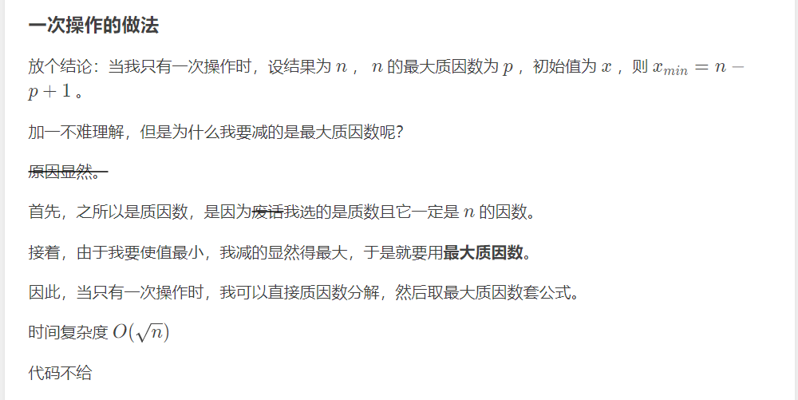

# 选素数

涉及知识点：线性筛

原题链接：[P8795 [蓝桥杯 2022 国 A\] 选素数 - 洛谷 | 计算机科学教育新生态 (luogu.com.cn)](https://www.luogu.com.cn/problem/P8795)

## 题解

[P8795 [蓝桥杯 2022 国 A\] 选素数 - 洛谷 | 计算机科学教育新生态 (luogu.com.cn)](https://www.luogu.com.cn/problem/solution/P8795)




## 个人题解

一直T，我靠

首先：要明白每次如何选择，

一次操作：对于结果为n，有很多质因子，n-质因子+1，取最小，既是质因子取最大，

二次操作：问题在于不清楚哪一个数对应答案最佳，所以暴力min=n-最大质因子+1，max=n

筛最大质因子的方法：借鉴欧拉筛的方法，

代码：

```C++
int a[maxj];
vec pri;
void check(int n){
	for(int i=2;i<=n;++i){//欧式筛的影子，得出最大质因子
		if(!a[i]){
			pri.emplace_back(i);
			a[i]=i;
		}
		for(auto j:pri){
			if(i*j>n)break;
			a[i*j]=max(max(a[i*j],j),a[i]);//递推，求最大质因数
			if(i%j==0)break;
		}
	}
}
void solve(){
	int n;
	cin>>n;
	check(n);
	// for(int i=1;i<=n;++i)cout<<a[i]<<'\n';
	// cout<<'\n';
	int mn=n+2;
	if(a[n]==n){
		puts("-1");
		return ;
	}
	// cout<<a[n];
	for(int i=n-a[n]+1;i<n;++i){
		if(a[i]!=i)
		mn=min(i-a[i]+1,mn);
	}cout<<mn<<'\n';
}   
```


## 筛最大质因子的板子

最主要在于:a[i*j]=max(max(a[i *j],j),a[i]);//递推，求最大质因数

每次都由自己、j质因子、a[i],选最大质因子，a[i]指i的最大质因子。

```C++
int a[maxj];
vec pri;
void check(int n){
	for(int i=2;i<=n;++i){//欧式筛的影子，得出最大质因子
		if(!a[i]){
			pri.emplace_back(i);
			a[i]=i;
		}
		for(auto j:pri){
			if(i*j>n)break;
			a[i*j]=max(max(a[i*j],j),a[i]);//递推，求最大质因数
			if(i%j==0)break;
		}
	}
}
```

