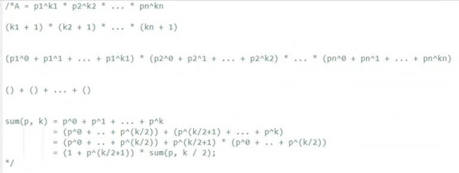

## 一、4993.FEB

[4993. FEB - AcWing题库](https://www.acwing.com/problem/content/4996/)

- 先分后和，分类讨论。举特例，数学归纳法

- 第一步，逐段分析
- 第二步，求每段的情况

第一种情况：xxxxx     0 1 2....k-1 ->   全都不一样 ...全都一样

第二种情况：0xxxxx  0 1 .... k     ->  全都不一样 ...全都一样

第三种情况：0xxxxx0  分k的奇偶 -> k 奇 0 2 ....k+1          ;k 偶 1 3 ....k+1    

第四种情况：0xxxxx1  分k的奇偶 -> k 奇 1 2 ....k+1          ;k 偶 0 3 ....k+1    

举例子然后分析可以得到每种情况的类型数量

- 第三步，合并

公差2和2合并，公差为2

公差2和1合并，公差为1

对应最大值，最小值分别为两个数组最大和最小的和

- 第四步，代码

第一种情况对应特例，第二种情况对应边界，三、四种情况对应中间部分

至于合并时的最大、最小值，全在于和前边一样不一样

代码：

```c++
#include <iostream>
#include <cstring>
#include <algorithm>

using namespace std;

int n;
string s;

int main()
{
    cin >> n >> s;

    if (s == string(n, 'F'))
    {
        cout << n << endl;
        for (int i = 0; i < n; i ++ )
            cout << i << endl;
    }
    else
    {
        int l = 0, r = n - 1;
        while (s[l] == 'F') l ++ ;
        while (s[r] == 'F') r -- ;

        int low = 0, high = 0;
        auto str = s;
        for (int i = l; i <= r; i ++ )
        {
            if (str[i] == 'F')
            {
                if (str[i - 1] == 'B') str[i] = 'E';
                else str[i] = 'B';
            }
            if (i > l && str[i] == str[i - 1]) low ++ ;
        }

        str = s;
        for (int i = l; i <= r; i ++ )
        {
            if (str[i] == 'F') str[i] = str[i - 1];
            if (i > l && str[i] == str[i - 1]) high ++ ;
        }

        int ends = l + n - 1 - r, d = 2;
        if (ends) high += ends, d = 1;

        cout << (high - low) / d + 1 << endl;
        for (int i = low; i <= high; i += d)
            cout << i << endl;
    }

    return 0;
}
```

## 二、4966.填充

[4966. 填充 - AcWing题库](https://www.acwing.com/problem/content/4969/)

贪心，最优解

贪心问题往往是公式推导，策略选择，方法的证明

本题，在能配对的前提下，尽可能左配，左配能替代右配或者更优

代码：

```c++
void solve(){
    string s;
    cin>>s;
    int ans=0;
    for(int i=0;i+1<s.size();++i){
        char a=s[i],b=s[i+1];
        if(a=='?'||b=='?'||a==b)ans++,i++;
    }
    cout<<ans<<'\n';
}
```

## 三、5407管道

[5407. 管道 - AcWing题库](https://www.acwing.com/problem/content/5410/)

二分答案，check用区间合并

本题的区间合并又有点不太一样

区间合并板子：

```c++
void merge(vector<PII> &segs)
{
    vector<PII> res;

    sort(segs.begin(), segs.end());

    int st = -2e9, ed = -2e9;
    for (auto seg : segs)
        if (ed < seg.first)
        {
            if (st != -2e9) res.push_back({st, ed});
            st = seg.first, ed = seg.second;
        }
        else ed = max(ed, seg.second);

    if (st != -2e9) res.push_back({st, ed});

    segs = res;
}
```

本题代码：

```c++

int n,m;
pair<int,int> w[N];
bool check(int mid){
    vector<pair<int,int> >p;
    for(int i=0;i<n;++i){
        int l=w[i].first,s=w[i].second;
        if(s<=mid){
            int t=mid-s;
            p.push_back({max(1ll,l-t),min(m,l+t)});
        }
    }
    int st=-1,ed=-1;
    sort(p.begin(),p.end());
    //本题的区间合并需要考虑加1，因为两点之间没有东西了也叫覆盖
    for(int i=0;i<p.size();++i){
        if(p[i].first<=ed+1)ed=max(ed,p[i].second);
        else st=p[i].first,ed=p[i].second;
    }
    return  st==1&&ed==m;
}
void solve(){
    //二分+区间合并
    cin>>n>>m;
    for(int i=0;i<n;++i){
        cin>>w[i].first>>w[i].second;
    }
    int l=0,r=2e9;
    while(l<r){
        int mid=l+r>>1;
        if(check(mid))r=mid;
        else l=mid+1;
        // cout<<l<<'\n';
    }
    cout<<r<<'\n';
}
```

## 四、4968. 互质数的个数

```c++

#define int long long
const  int N=2e5+100,MOD=998244353,inf=0x7f7f7f7f7f7f7f7f;
int ksm(int a,int b){
    int ans=1;
    while(b){
        if(b&1)ans=ans*a%MOD;

        a=a*a%MOD;
        b>>=1;
    }
    return ans%MOD;

}
int pri[N],vis[N];
void solve(){
	int a,b;
    cin>>a>>b;
    // 题意：范围小于给定数，互质数的个数
    /*
        欧拉函数板子题：给定a，函数算出1<=x<=a ,__gcd(x,a)==1 的个数
        a=p1^a1 * p2^a2 * p3^a3 ....pn^an
        结果=a*((p1-1)/p1*(p2-1)/p2*(p3-1)/p3.....)

        本题多一个b次方，除法可以考虑逆序对或者转换公式

    */
   if(a==1){
        cout<<0<<'\n';
        return ;
   }
    // 素数质数  欧式筛快速幂
    int res=a,x=a;
    for(int i=2;i*i<=x;++i){
        if(x%i==0)
        {
            while(x%i==0)x/=i;
            res=res/i*(i-1)%MOD;
        }
    }
    if(x>1)res=res/x*(x-1)%MOD;
    cout<<res*ksm(a,b-1)%MOD;
}   

```

## 五、5406. 松散子序列

```c++
int dp[N];// 当前位置下的最大值
void solve(){
    string s;cin>>s;
    int n=s.size();
    s=' '+s;
    // 符合条件下的子序列价值最大, 像是策略dp

    /*
    
        dp 主要在于状态和如何进行不同状态下的转移
        常见的在于选和不选，   以及不同状态之间转移方案的选择

    */
   dp[1]=s[1]-'a'+1;
    for(int i=1;i<=n;++i){
        // 当前位置不选，前一个位置即为最大
        // 当前位置选，从之前的位置开始，更新当前的值
        dp[i]=max(dp[i-1],dp[i-2]+s[i]-'a'+1);

    }
    cout<<dp[n]<<'\n';
}   
```

## 六、5408. 保险箱

[5408. 保险箱 - AcWing题库](https://www.acwing.com/problem/content/5411/)

```c++
int dp[N][3];
void solve(){
    int n;cin>>n;
    string x,y;
    cin>>x>>y;
    //题意：x通过每一位的改变变成y，求最小修改次数
    /*
        策略在于
          发现变化，当前位的借位或者进位 只会影响高位，不会影响低位
          模拟每一种情况的变化

    */
    x=' '+x;
    y=' '+y;
    // 0当前位正常加减  1表示当前位加减会想左进位  2当前位加减会向左借位
    dp[n][0]=abs(x[n]-y[n]);
    dp[n][1]=-x[n]+y[n]+10;
    dp[n][2]=x[n]-y[n]+10;
    for(int i=n-1;i>=1;--i){
        int xx=x[i]-'0';
        int yy=y[i]-'0';
        // 0状态的转移
        dp[i][0]=min({dp[i+1][0]+abs(xx-yy),dp[i+1][1]+abs(xx-yy+1),dp[i+1][2]+abs(xx-1-yy)});
        
        // 1 
        dp[i][1]=min({dp[i+1][0]+yy-xx+10,dp[i+1][1]+yy-xx+9,dp[i+1][2]+yy-xx+11});

        // 2
        dp[i][2]=min({dp[i+1][0]+xx-yy+10,dp[i+1][1]+xx-yy+11,dp[i+1][2]+xx-yy+9});

    }
    cout<<min({dp[1][0],dp[1][1],dp[1][2]})<<'\n';
}  
```

## 七、4662. 因数平方和

[4662. 因数平方和 - AcWing题库](https://www.acwing.com/problem/content/4665/)

[AcWing 4662. 【数学, 数论分块】因数平方和【蓝桥杯】 - AcWing](https://www.acwing.com/solution/content/174106/)

数论分块

```c++
int ask(int n){
    // 1-n 的 i*i 的和， == n*(n+1)*(n*2+1)/6;
    return n*(n+1ll)%MOD*(2*n%MOD+1ll)%MOD* 166666668%MOD; 
}
void solve(){
    int n;cin>>n;
    // 数学,公式推导,整除个数
    int ans=0;
    /*
        最开始发现的规律：1-n 每个数是 i*i*(n/i) 然后求和 =》(n/i)可以提示数学分块 
        转换求数学分块和，转换=>(n/i)*(求和l-r((求和1-r)(i*i)-(求和1-（l-1))(i*i)))
        这里运用了，分块和，前缀和，固定公式

    */
    for(int l=1;l<=n;){
        int x=n/l,r=n/x;
        ans=(ans+(ask(r)-ask(l-1))*x%MOD)%MOD;
        l=r+1;
    }
    cout<<(ans+MOD)%MOD<<'\n';
}   
```

## 八、4646. 爬树的甲壳虫（需要再看

[4646. 爬树的甲壳虫 - AcWing题库](https://www.acwing.com/problem/content/4649/)

```c++
void solve()
{
    int n;
    cin >> n;
    int res = 0;
    for (int i = 1; i <= n; ++i)
    {
        int x, y;
        cin >> x >> y;
        res = (res + 1ll) % MOD * y % MOD * ksm(y - x, MOD - 2ll) % MOD;
    }
    cout << res << '\n';
}
```

## 九、4656、技能提升 ：二分

[4656. 技能升级 - AcWing题库](https://www.acwing.com/problem/content/4659/)


```c++
int a[N],b[N];
int sum(int r,int cnt,int d){
    int l=r-d*(cnt-1);
    return (l+r)*cnt/2;
}
    int n,m;
bool check(int x){
    // 检查到达这个值所需的次数是否可以满足
    int cnt=0;
    for(int i=1;i<=n;++i){
        if(a[i]>x){
            cnt+=ceil(1.0*(a[i]-x)/b[i]);

        }
    }
    return cnt<=m;
}
void solve()
{
    // 增加的技能点数会变小
    /*
        等差数列+二分
        二分的是数据下界，
    */

    cin>>n>>m;
    for(int i=1;i<=n;++i){
        cin>>a[i]>>b[i];
    }
    int l=0,r=1e6,ans=0,now=0,cnt=0;
    while(l<=r){
        int mid=l+r>>1;
        if(check(mid)){
            r=mid-1;
            ans=mid;
        }else l=mid+1;
    }
    int ass=0;
    for(int i=1;i<=n;++i){
        if(a[i]>ans){
            now=ceil(1.0*(a[i]-ans)/b[i]); // ceil使用先转换成浮点型，精度损失
            cnt+=now;
            ass+=sum(a[i],now,b[i]);
        }
    }
    cout<<ass+(m-cnt)*ans<<'\n'; // 之所以会有 (m-cnt)*ans ，反向思维，最后的值不是ans的话cnt个数会变多，所以不合理
}
```

## 十、1225、正则问题  ：dfs或者栈

[1225. 正则问题 - AcWing题库](https://www.acwing.com/problem/content/description/1227/)

```c++
int id;// 这个id得放外边，不然的话向上回溯的时候id没变化 
int dfs(){
	int res=0;
	// 对于每种可能的情况进行特判
	while(id<s.size()){
		// 代表开始，累加 
		if(s[id]=='('){
			id++;
			res += dfs();
			id++;
		}
		// 代表最后，结束 
		else if(s[id] == ')'){
//			cout<<res<<'\n';
			break;
		}
		// 代表左右只能选一个 
		else if(s[id] == '|'){
			id++;
			res=max(res, dfs());
		}
		// 正常运行计数 
		else {
			id++;
			res++;
		}
	} 
	return res;
}
void solve(){
	// 字符匹配的问题,在括号里找到最长的字符用于字符串匹配 
	cin>>s;
	// 有层次问题，用dfs递归解决
	cout<<dfs()<<'\n';
}

```

## 十一：97、约数之和 ：分治法或者公式法

[97. 约数之和 - AcWing题库](https://www.acwing.com/problem/content/99/)

### 约数之和公式推导



### 质因子分解

一定要注意最后分解的数是否还有

```c++
void divide(int x)
{
    for (int i = 2; i <= x / i; i ++ )
        if (x % i == 0)
        {
            int s = 0;
            while (x % i == 0) x /= i, s ++ ;
            cout << i << ' ' << s << endl;
        }
    if (x > 1) cout << x << ' ' << 1 << endl;
    cout << endl;
}
```


### 代码

```c++
int sum(int p,int k){
	if(k==0)return 1;
	// 奇数个情况时转换成偶数情况 , +1是因为p^0被特判了 
	if(k%2==0)return (p%MOD*sum(p,k-1)%MOD+1)%MOD;
	else return (ksm(p,k/2+1)%MOD+1)%MOD*sum(p,k/2)%MOD;
}
void solve(){
	// a的b次方的约数之和 
	// 约数之和常见公式结论+快速幂+分治+公式推导 + 质因子分解 
	int a,b;
	cin>>a>>b;
	int res=1;
	for(int i=2;i<=a;++i){
		// 循环质因子分解
		int s=0;
		while(a%i==0){
			a/=i;
			s++;
		} 
		res=res*sum(i,s*b)%MOD;
	}
	if(a==0)res=0;
	cout<<res<<'\n';
}
```

## 十二、98、分形之城 ：坐标变换，递归

[98. 分形之城 - AcWing题库](https://www.acwing.com/problem/content/100/)

坐标变换：平移，对称，规律

递归：每次将块数变小 , 注意画图，注意细节，注意1加1ll

```c++
#define int long long
#define pii pair<int,int>
pii sum(int n,int a){// 第n级编号为a 
	if(n==0)return {0,0};
	// 缩减到某一块,1/4份的个数，长度 
	int block=(1ll<<2*n-2ll),len=(1ll<<n-1ll);
	auto now=sum(n-1,a%block);
	int z=a/block,xx=now.first,yy=now.second;
	// 看属于那一块进行特殊处理
	if(z==0){
		// 关于y=x轴对称
		return {yy,xx}; 
	} else if(z==1){
		// 向右平移len
		return {xx,yy+len}; 
	} else if(z==2){
		// 向右下角平移
		return {xx+len,yy+len}; 
	} else {
		// 左下角，关于截距1<<n-1对称,画图注意变化
		return {len*2-yy-1,len-xx-1}; 
	}
}
void solve(){
	int n,a,b;cin>>n>>a>>b;
	// 每次通过缩减规模从而解决问题,编号从0开始
	auto pa=sum(n,a-1);
	auto pb=sum(n,b-1);
	// 最后的距离是坐标平方和sqrt，一个单位是10
	printf("%.0lf\n",sqrt((pa.first-pb.first)*(pa.first-pb.first)+(pa.second-pb.second)*(pa.second-pb.second))*10);
// 	cout<<(int)(ceil())<<'\n'; 
}
```

