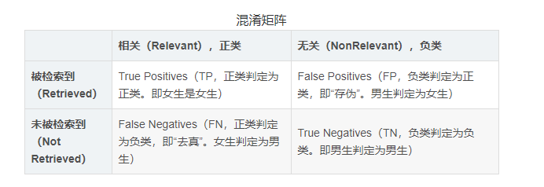
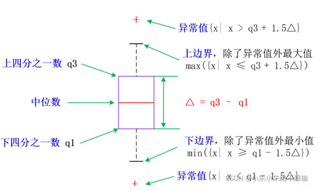

# 数据分析、数据挖掘、机器学习相关内容总结

   **本博客结合大量项目， 从实战出发， 细致讲解关于数据分析、数据挖掘、机器学习等内容知识。**（**持续更新中**）

## 关于pip

```
#卸载安装pip
python -m pip uninstall pip
python -m ensurepip

# 更新pip
pip install --upgrade pip

# 更换pip镜像源
pip config set global.index-url https://pypi.tuna.tsinghua.edu.cn/simple

# 清除缓存
pip cache purge

# 更新指定包
pip install -U pip setuptools

# 指定清华镜像下载指定包
pip install paddlepaddle==2.3.0 -i https://pypi.tuna.tsinghua.edu.cn/simple

```


## 关于conda

```
# 更换清华镜像源
conda config --add channels https://mirrors.tuna.tsinghua.edu.cn/anaconda/pkgs/free/
conda config --add channels https://mirrors.tuna.tsinghua.edu.cn/anaconda/pkgs/main/

# 优先使用清华镜像
conda config --prepend channels https://mirrors.tuna.tsinghua.edu.cn/anaconda/pkgs/main
conda config --prepend channels https://mirrors.tuna.tsinghua.edu.cn/anaconda/pkgs/free

# 清除缓存
conda clean --all

# 更新conda
conda update conda

# conda实在不好用可以用pip在Anaconda Prompt中安装相关包
```
## jupyter相关内容

```
# jupyter重装命令
pip install --upgrade --force-reinstall --no-cache-dir jupyter

# 绘图字体问题
plt.rcParams['font.sans-serif'] = [u'SimHei']
plt.rcParams['axes.unicode_minus'] = False

```
## orange相关内容

```
# 通过Anaconda安装orange
conda config --add channels conda-forge
conda install orange3

# 启动orange
orange-canvas

# 卸载
pip uninstall orange orange-canvas-core orange-widget-base

```

## Pytorch


## 常见包的理解：

### pandas

Pandas 提供了易于使用的数据结构和数据分析工具，特别适用于处理结构化数据，如表格型数据（类似于Excel表格）。

Pandas 主要引入了两种新的数据结构：**DataFrame** 和 **Series**。**DataFrame 可视为由多个 Series 组成的数据结构**

https://blog.csdn.net/qq_44766883/article/details/108176973

### numpy

支持大量的维度数组与矩阵运算，此外也针对数组运算提供大量的数学函数库。

https://www.cnblogs.com/lemonbit/p/7043879.html

### matplotlib

它能让使用者很轻松地将数据图形化，并且提供多样化的输出格式。

https://www.zhihu.com/tardis/zm/art/139052035?source_id=1003

### sklearn

SKLearn中有六大任务模块，如下图所示：分别是分类、回归、聚类、降维、模型选择和预处理。

https://www.showmeai.tech/article-detail/203

## 常见的数据处理命令

### 基本命令

```python
# 导入基本包
import pandas as pd
import numpy as np
import seaborn as sns
import matplotlib.pyplot as plt
import matplotlib
plt.rcParams['font.sans-serif']=['SimHei']   # 用来正常显示中文标签
plt.rcParams['axes.unicode_minus']=False     # 用来正常显示负号
matplotlib.rc("font",family='SimHei')
%matplotlib inline
import jieba
import nltk

import warnings
warnings.filterwarnings('ignore')


# 文件导入，数据探索
df = pd.read_csv('./input/data.csv')
df.head(5) # 查看文件前5行
df.shape # 查看数据大小
df.info() # 查看数格式，空值等信息
df.describe() # 查看数据基本的统计信息
df['属性'].value_counts() # 某一列按不同值计数，返回的是计数列向量
df['属性'].replace([1,3,4,5,6],[3,1,0,0,0],inplace=True) # 对应属性值被替代，inplace=true时，会替换原内容，不返回副本
df = pd.concat([df, dummy_df], axis=1) #前后拼接操作，axis=0按列 axis=1按行
df.mean(axis=0) # 按行显示均值
df.std(axis=0) # 按列显示均值
np.sum(pd.isnull(content)) # 检查空白内容
content = content[~index_of_juan].reset_index(drop=True) # 重新设置index，单用drop的时候，True不会新增一列，False会新增一列index
chapter_names_split = chapter_names.str.split(" ").reset_index(drop=True) # 处理章节名，按照空格分割字符串，返回的是分割后的字符串列表
garments.drop(columns=['属性'], inplace=True) # 删除‘属性’这一列


# iloc[a:b,c:d]:取行索引从a到b-1，列索引从c到d-1的数据。
print(df.iloc[0:2,0:2])
print(df.iloc[0:2,0:2].values)
#Out1：   姓名   班级
#      0  小明  302
#      1  小王  303
#Out2：[['小明' 302]
#       ['小王' 303]]

df['属性'].value_counts() # 对于每种可能进行计数

df['属性'].replace([情况1,情况2],[new情况1，new情况2],inplace=True) # inplace为True时，将新的数据替换原数据


```

### 如何每一段内容的开始index和结束index

```python
## 使用正则表达式，选取相应索引
index_of_hui = content.content.str.match("^第+.+回")

## 根据索引选取每一章节的标题
chapter_names = content.content[index_of_hui].reset_index(drop=True)
chapter_names.head()

## 建立保存数据的数据框
data = pd.DataFrame(list(chapter_names_split),columns=["chapter","left_name","right_name"])

## 添加章节序号和章节名称列
data["chapter_number"] = np.arange(1,121)
data["chapter_name"] = data.left_name+","+data.right_name

## 添加每章开始的行位置
data["start_id"] = index_of_hui[index_of_hui == True].index

## 添加每章结束的行位置
data["end_id"] = data["start_id"][1:len(data["start_id"])].reset_index(drop = True) - 1
data["end_id"][[len(data["end_id"])-1]] = content.index[-1]

## 添加每章的行数
data["length_of_chapters"] = data.end_id - data.start_id

data.head()
```

### groupby、apply、agg函数的应用

**apply**

```python
DataFrame.apply(func, axis=0) 
# func 代表的是传入的函数或 lambda 表达式；
# axis 参数可提供的有两个，该参数默认为0/列

# lambda 表达式 
df.A = df.A.apply(lambda x:str(x)+"\tYes" if x%2==0 else str(x)+"\tNo") #对A列逐个判断，x相当于单个元素，满足条件做出对应条件的操作

## 可以自定义函数进行操作
def addOne(data):
    return data + 1

df['Age'] = df['Age'].apply(addOne)
df['Age'] = df['Age'].apply(int)
```

**groupby**

https://www.51cto.com/article/720182.html

[pandas之分组groupby()的使用整理与总结-CSDN博客](https://blog.csdn.net/FrankieHello/article/details/97272990)

```python
import pandas as pd
import numpy as np
import matplotlib.pyplot as plt
sales.groupby("store")["stock_qty"].agg(["mean", "max"]) # 按store属性聚类，筛选stock_qty列并进行相应聚合

# 按sex聚类，返回['Age', 'Score']的mean
grouped = df.groupby('Sex')
print(grouped.mean()[['Age', 'Score']])
```

**agg**

https://blog.csdn.net/weixin_45144170/article/details/105008350

默认对行进行聚合操作，常用于groupby之后，有max，min，mean，std，sum，median（中位数），var（方差），count（计数）

https://pandas.pydata.org/pandas-docs/stable/reference/api/pandas.DataFrame.agg.html

```python
import pandas as pd
import numpy as np
import matplotlib.pyplot as plt

sales.groupby("store")["stock_qty"].agg(["mean", "max"]) # 这些函数聚合到行上

df.agg({'A' : ['sum', 'min'], 'B' : ['min', 'max']}) # 每列有不同的聚合

## 可以自定义函数，并对指定属性进行操作

def getSum(data):
    total = 0
    for d in data:
        total+=d
    return total


print(grouped.aggregate(np.median))
print(grouped.aggregate({'Age':np.median, 'Score':np.sum}))
print(grouped.aggregate({'Age':getSum}))

```

### 词频分析+词云

**参照项目六：**

```python
## 对红楼梦全文进行分词

# 数据表的行列数
row,col = data.shape

# 预定义列表
data["cutted_words"] = ''

# 指定自定义的词典，以便包含jieba词库里没有的词，保证更高的正确率
jieba.load_userdict('./input/Red_Mansion_Dictionary.txt')

for i in np.arange(row):
    # 分词
    cutwords = list(jieba.cut(data.content[i]))
    # 去除长度为1的词
    cutwords = pd.Series(cutwords)[pd.Series(cutwords).apply(len)>1]
    # 去停用词
    cutwords = cutwords[~cutwords.isin(stop_words)]
    data.cutted_words[i] = cutwords.values

# 添加每一章节的词数
data['length_of_words'] = data.cutted_words.apply(len)
data['cutted_words'].head()


## 统计全书的词频，计算每个词出现的频率并排序
words = np.concatenate(data.cutted_words)

#统计词频
word_df = pd.DataFrame({"word":words})
word_frequency = word_df.groupby(by=["word"])["word"].agg({"count"}).reset_index()
word_frequency.columns = ["word","frequency"]
word_frequency = word_frequency.reset_index().sort_values(by="frequency",ascending=False)

word_frequency.head(10)

## 使用条形图展示满足一定条件的词语
plt.figure(figsize=(8,10))

frequent_words = word_frequency.loc[word_frequency.frequency > 500].sort_values('frequency')
plt.barh(y = frequent_words["word"],width = frequent_words["frequency"])

plt.xticks(size = 10)  
plt.ylabel("关键词")   
plt.xlabel("频数")
plt.title("红楼梦词频分析")
plt.show()

## 如何绘制词云
from wordcloud import WordCloud

plt.figure(figsize=(10,5))

wordcloud = WordCloud(font_path='./input/SimHei.ttf',margin=5, width=1800, height=900)

wordcloud.generate("/".join(np.concatenate(data.cutted_words))) # np.concatenate将分词转换成一维数组，需要有/或者空格分隔

plt.imshow(wordcloud)
plt.axis("off")
plt.show()

```

### 排序sort使用

默认升序

**demo：**

```python
word_frequency = word_frequency.reset_index().sort_values(by="某一属性",ascending=False) # 按照某一属性，降序排列 

```

## 相关性判断

### 热力图判断相关性

https://blog.csdn.net/weixin_60737527/article/details/126048311

```python
# cmap：热图颜色风格，与matplotlib中cmap相同，详解附录。
# annot：True,False，是否显示数值注释,默认为False。
# cbar：True,False 是否显示标尺，默认为True。
# linewidth：每个小方格之间的间距。
# linecolor：分割线的颜色。
# annot_kws：{'color':'  ','size':  ,'family':'  ','style':'  ','weight':  ,......}，单元格数值标签属性。
##样例1
plt.figure(figsize = (12,12))
df1 = df.iloc[:,[1,6,7,8,9,10,11,12,13,14,15,16,17,18,19,20,21,22,23]].copy()
plt.title('连续型变量皮尔逊相关系数热力图',fontsize=20)
sns.heatmap(df1.corr(),annot = True,cmap="Blues",annot_kws={'fontsize':9})

## 样例2
# 计算相关系数
# print(garments.dtypes)
# 自动选择浮点型列  
float_columns = garments.select_dtypes(include=[np.float64])  
# 计算浮点型列之间的相关系数  
corr = float_columns.corr()  
fig = plt.figure(figsize=(7,7))

cmap = sns.diverging_palette(220,10,as_cmap=True) # 改变颜色 ，颜色范围 as_cmap返回返回一个 matplotlib colormap 而不是一个颜色列表。
mask = np.zeros_like(corr, dtype=bool)  # 将np.bool更改为bool  
mask[np.triu_indices_from(mask)] = True # 返回矩阵上三角矩阵，其值设为true不显示

sns.heatmap(corr, annot=True, square=True,linewidths=1.5, cmap=cmap, mask=mask, center=0, cbar_kws={"shrink": .5})

plt.title("特征间的相关性",fontsize=15)

plt.show()

```
### 卡方
**可参考项目三**

```python
from sklearn.feature_selection import SelectKBest
from sklearn.feature_selection import chi2

y = df['default.payment.next.month']
X = df[['SEX','EDUCATION','MARRIAGE']]

chi2_selector = SelectKBest(chi2, k=2)
chi2_selector.fit(X, y)
# 给出x对应的卡方得分
chi2_selector.scores_
# 属性保存了每个特征的卡方检验的p值
# 如果p值很小（通常小于某个显著性水平，如0.05或0.01），则我们拒绝原假设，认为该特征与目标变量之间存在显著的关联性。
chi2_selector.pvalues_
```

**demo**

```python
from sklearn.feature_selection import SelectKBest, chi2  
from sklearn.datasets import load_iris  
  
# 加载iris数据集  
iris = load_iris()  
X, y = iris.data, iris.target  
  
# 初始化SelectKBest对象，使用chi2作为得分函数  
chi2_selector = SelectKBest(score_func=chi2, k=2)  
  
# 拟合模型  
chi2_selector.fit(X, y)  
  
# 输出每个特征的p值  
print("P-values for each feature:", chi2_selector.pvalues_)  
  
# 转换特征，只保留得分最高的k个特征  
X_new = chi2_selector.transform(X)  
  
# 输出选定的特征索引  
print("Selected feature indices:", chi2_selector.get_support(indices=True))

```


## TF-IDF

### 相关理解

[一文看懂 TF-IDF (概念图解+4大变种+发展历史) (easyai.tech)](https://easyai.tech/ai-definition/tf-idf/)

**TF （Term Frequency）—— “单词频率”**

一个查询关键字中某一个单词在目标文档中出现的次数。

**IDF（Inverse Document Frequency）—— “逆文档频率”**

“惩罚”（Penalize）那些出现在太多文档中的单词。

### 代码demo

**参看项目六**

- TfidfVectorizer模型建立后，可通过`fit_transform()`函数进行训练，将文本中的词语转换为词的TF－IDF矩阵；通过`get_feature_names()`可看到所有文本的关键字；通过`vocabulary_`属性查看关键词编号。TfidfVectorizer模型的输出为矩阵形式，通过`toarray()`函数可看到TF－IDF矩阵的结果。

**项目内截出**

```python
## 导包
from sklearn.feature_extraction.text import TfidfVectorizer

content = []
for cutword in data.cutted_words:
    content.append(" ".join(cutword))

## 构建语料库，并计算文档的TF－IDF矩阵
transformer = TfidfVectorizer()
tfidf = transformer.fit_transform(content)

## TF－IDF以稀疏矩阵的形式存储，将TF－IDF转化为数组的形式,文档－词矩阵
word_vectors = tfidf.toarray()
word_vectors

## 输出结果
# array([[0.        , 0.        , 0.00732401, ..., 0.        , 0.        ,
#         0.        ],
#        [0.        , 0.        , 0.0089662 , ..., 0.        , 0.        ,
#         0.        ],
#        [0.04321373, 0.        , 0.0486704 , ..., 0.        , 0.        ,
#         0.        ],
#        ...,
#        [0.        , 0.        , 0.        , ..., 0.        , 0.        ,
#         0.        ],
#        [0.        , 0.        , 0.00731152, ..., 0.        , 0.        ,
#         0.        ],
#        [0.        , 0.        , 0.00886065, ..., 0.        , 0.        ,
#         0.        ]])
```

**demo**

[一个例子来使用sklearn中的TfidfVectorizer_tfidvectorizer 单汉字-CSDN博客](https://blog.csdn.net/qq_43391414/article/details/112912107)


```python
from sklearn.feature_extraction.text import TfidfVectorizer
# 训练数据
train = ["Chinese Beijing Chinese","Chinese Chinese Shanghai","Chinese Macao","Tokyo Japan Chinese"]

# 将训练数据转化为向量。

tv=TfidfVectorizer() # 初始化一个空的tv。
tv_fit=tv.fit_transform(train) # 用训练数据充实tv,也充实了tv_fit。
print("fit后，所有的词汇如下：")
print(tv.get_feature_names_out())
print("fit后，训练数据的向量化表示为：")
print(tv_fit.toarray())

```


## 时间的处理


## 离散特征编码

- One-Hot编码和哑变量编码都只能对离散型变量进行编码。

### 独热编码

有限类别，需要将字符串转换成数值型时，独热编码（one hot encoding）会将有限类别转换成数值向量

One-Hot编码之后生成的新特征数等于对应特征的不同种类取值个数

对于没有排序的离散变量,如果是距离模型(聚类和KNN等),OneHOt编码显然会更合理.

### 哑变量编码（dummy）

哑变量编码之后生成的新特征数比对应特征的取值个数少1个。

避免了多重共线性 （Multicollinearity）问题。

### 实际应用

1. 哑变量编码
2. pd.get_dummies()方法即可以用于产生One-Hot编码，也可以用于产生哑变量编码
3. 当drop_first=True时为哑变量编码，当为False时为One-Hot编码
4. 哑变量编码是将One-Hot编码的第一列结果去掉即可。
**参看项目三**

```python
import pandas as pd
# 官方文档
pandas.get_dummies(data, prefix=None, prefix_sep='_', dummy_na=False, columns=None, sparse=False, drop_first=False)[source])
# 实际应用

# 指定单列独热，并添加到原数据的后边，没有删除原数据
df = df.join(pd.get_dummies(df.color))
# 指定单列独热，并添加到原数据的后边，删除原数据
dummies = pd.get_dummies(df[category_features])
train_df = pd.concat([df, dummies], axis=1).drop(category_features, axis=1)

# 指定多列独热，并添加到原数据后边，删除原数据
str_columns = ['SEX','MARRIAGE']
df_new = pd.get_dummies(df,columns=str_columns)
df_new
```

## 数据标准化

### Z-sorce标准化（正规化方法

#### 理解

公式=x-E(x)/(sqrt(D(x))) 

标准化后的变量值围绕0上下波动，大于0说明高于平均水平，小于0说明低于平均水平。

将特征数据的分布调整成标准正态分布，也叫高斯分布，也就是使得数据的均值维0，方差为1.

#### 代码：

方式1：

```python
from sklearn.model_selection import train_test_split
from sklearn.preprocessing import StandardScaler

X=garments.drop(['actual_productivity'],axis=1)
y=garments['actual_productivity']

X_train, X_test, y_train, y_test = train_test_split(X, y, test_size=0.2, random_state=1)

# 数据标准化  测试集使用fit_transform验证集使用transform
s = StandardScaler()
X_train_sm = s.fit_transform(X_train)
X_test_sm = s.transform(X_test)

X_train_sm = X_train
X_test_sm = X_test

```

方式2：

```python
from sklearn import preprocessing
import numpy as np 
x = np.array([[1., -1., 2.],
              [2., 0., 0.],
              [0., 1., -1.]])
# 将每一列特征标准化为标准正态分布，注意，标准化是针对每一列而言的
x_scale = preprocessing.scale(x)
x_scale

```


```python
X.iloc[:,0:20] = preprocessing.scale(X.iloc[:,0:20])
X.sample(5)
# 显示效果
print ('均值为：{a}'.format(a = X.LIMIT_BAL.mean()))
print ('标准差为：{a}'.format(a = X.LIMIT_BAL.std()))
```


## 数据集划分

对于分类问题，需要划分训练集和测试集

```python
y = df_new['default.payment.next.month']
X = df_new.drop(columns=['ID','default.payment.next.month']) # 不要无关、x轴的属性
X_train, X_test,y_train, y_test = train_test_split(X, y, test_size=0.3, random_state=0)
# 查看对应值所占比例
print (y_train.value_counts()/len(y_train))
print (y_test.value_counts()/len(y_test))
```


## 常见模型总结

### 线性回归

#### 相关理解

​    通过使用另一个相关的已知数据值来预测未知数据的值。

​    它以数学方式将未知变量或因变量以及已知变量或自变量建模为线性方程。

​    例如，假设你有关于去年的支出和收入的数据。线性回归技术会分析这些数据，并确定您的支出是收入的一半。然后，他们通过将未来已知收入减半来计算未知的未来支出。

#### demo

**项目七**

```python
from sklearn.linear_model import LinearRegression
from sklearn.metrics import r2_score,mean_squared_error

mlr = LinearRegression()
mlr.fit(X_train_sm, y_train)
y_pred_sm = mlr.predict(X_test_sm)

print(f'R2 为 {round(r2_score(y_test,y_pred_sm),4)}')
print('均方误差 (MSE): %.4f' % mean_squared_error(y_test, y_pred_sm))

# 可视化
plt.figure(figsize=(6, 4))

plt.scatter(x=y_test,y=y_pred_sm, alpha=.5)

plt.xlabel('实际值')
plt.ylabel('预测值')
plt.title('实际值预测值对比',size=15)

plt.show()
```


### 逻辑回归模型

#### 相关理解：


#### demo：


### 支持向量机（SVM）


### 神经网络

#### 理解

有关神经网络的内容很多很多（**待补思维导图**

​    **神经网络**是模拟人类大脑处理信息方式的简化模型。 此模型的工作方式为模拟大量类似于神经元的抽象形式的互连处理单元。

​    这些处理单元都位于层中。 神经网络通常包含三个部分：**输入层**，其中的单元表示输入字段；一个或多个**隐藏层**；一个**输出层**，带有一个或多个表示目标字段的单元。 这些单元通过可变的连接强度（或 **权重** ）连接。 输入数据 显示在第一层，其值从每个神经元传播到下一层的每个神经元。 最终从输出层中输出结果。


​    前馈神经网络（Feedforward Neural Network）中，信息从输入层开始输入，每层的神经元接收前一级输入，并输出到下一级，直至输出层。整个网络信息输入传输中无反馈（循环）。即任何层的输出都不会影响同级层，可用一个有向无环图表示。

​    常见的前馈神经网络包括**卷积神经网络（CNN）**、全连接神经网络（FCN)、生成对抗网络(GAN)等。


​    反馈神经网络（Feedback Neural Network）中，神经元不但可以接收其他神经元的信号，而且可以接收自己的反馈信号。和前馈神经网络相比，反馈神经网络中的神经元具有记忆功能，在不同时刻具有不同的状态。反馈神经网络中的信息传播可以是单向也可以是双向传播，因此可以用一个有向循环图或者无向图来表示。

​    常见的反馈神经网络包括**循环神经网络(RNN)**、长短期记忆网络(LSTM)、Hopfield网络和玻尔兹曼机。


#### 简单demo

**分类是预测离散值输出，如类别标签，而回归则预测连续值输出，如价格或得分**

**项目七MLPClassifer**

```python
from sklearn.neural_network import MLPRegressor

mlp = MLPRegressor(random_state=1024)

mlp.fit(X_train_sm, y_train)

y_pred_sm = mlp.predict(X_test_sm)
y_pred_sm = pd.DataFrame(y_pred_sm)[0].apply(lambda x: 1 if x > 1 else x).values
y_pred_sm = pd.DataFrame(y_pred_sm)[0].apply(lambda x: 0 if x < 0 else x).values

print(f'R2 为 {round(r2_score(y_test,y_pred_sm),4)}')
print('均方误差 (MSE): %.4f' % mean_squared_error(y_test, y_pred_sm))

# 可视化
plt.figure(figsize=(6, 4))

plt.scatter(x=y_test,y=y_pred_sm, alpha=.5)

plt.xlabel('实际值')
plt.ylabel('预测值')
plt.title('实际值预测值对比',size=15)

plt.show()
```

https://blog.csdn.net/u011311291/article/details/78743393

```python
# two-layer neural network 
# train part

import numpy as np
from sklearn.neural_network import MLPClassifier
from sklearn.model_selection import KFold
from joblib import dump

#get training data
X = train_data[:,1:]
y = train_data[:,0]  

#neural network classifier of structure (3,2)
kf = KFold(n_splits=3) # 3-fold cross-validation
best_clf = None
best_score = 0
train_scores = []
test_scores = []
print("kfold-------")
for train_index, test_index in kf.split(X):
    # create neural network using MLPClassifer
    # 第一个隐藏层有3个神经元，第二个隐藏层有2个神经元
    clf = MLPClassifier(solver = 'sgd', activation = 'logistic', max_iter = 1000, hidden_layer_sizes = (3,2),random_state = 1)
    X_train, X_test = X[train_index], X[test_index]
    y_train, y_test = y[train_index], y[test_index]
    clf.fit(X_train, y_train)
    train_score = clf.score(X_train, y_train)
    train_scores.append(train_score)
 
    test_score = clf.score(X_test, y_test)
    test_scores.append(test_score)

    #compare score of the tree models and get the best one
    if test_score > best_score:
        best_score = test_score
        best_clf = clf
    
    #print(clf.n_outputs_)
in_sample_error = [1 - score for score in train_scores]
test_set_error = [1 - score for score in test_scores]
print("in_sample_error: ")
print(in_sample_error)
print("test_set_error: ")
print(test_set_error)

#store the classifier
if best_clf != None:
    dump(best_clf, "train_model.m")
```

**MLPRegressor**

https://zhuanlan.zhihu.com/p/46934912

```python
#coding:utf-8
from sklearn import neural_network
import matplotlib.pyplot as plt
import numpy as np
import sys

mlp = neural_network.MLPRegressor(hidden_layer_sizes=(10), activation="relu",
                 solver='adam', alpha=0.0001,
                 batch_size='auto', learning_rate="constant",
                 learning_rate_init=0.001,
                 power_t=0.5, max_iter=200,tol=1e-4)
x = np.arange(-3.0, 3.0, 0.1)
y = np.exp(x)
mlp.fit(np.asarray(x).reshape([-1,1]),y)
inp = [[ele] for ele in x]
pre = mlp.predict(inp)
plt.plot(np.asarray(x), np.asarray(y), 'bo')
plt.plot(np.asarray(inp), np.asarray(pre), 'ro')
plt.show()
```


### 贝叶斯网络


### 决策树

[一文看懂决策树 - Decision tree（3个步骤+3种典型算法+10个优缺点） (easyai.tech)](https://easyai.tech/ai-definition/decision-tree/)

#### 原理理解：

- 三个步骤：

**特征选择**

特征选择决定了使用哪些特征来做判断。在训练数据集中，每个样本的属性可能有很多个，不同属性的作用有大有小。因而特征选择的作用就是筛选出跟分类结果相关性较高的特征，也就是分类能力较强的特征。

在特征选择中通常使用的准则是：信息增益。

**决策树生成**

选择好特征后，就从根节点触发，对节点计算所有特征的信息增益，选择信息增益最大的特征作为节点特征，根据该特征的不同取值建立子节点；对每个子节点使用相同的方式生成新的子节点，直到信息增益很小或者没有特征可以选择为止。

**决策树剪枝**

剪枝的主要目的是对抗「过拟合」，通过主动去掉部分分支来降低过拟合的风险。

- 三种算法

**ID3 算法**

ID3 是最早提出的决策树算法，他就是利用信息增益来选择特征的。

**C4.5 算法**

他是 ID3 的改进版，他不是直接使用信息增益，而是引入“信息增益比”指标作为特征的选择依据。

**CART（Classification and Regression Tree）**

这种算法即可以用于分类，也可以用于回归问题。CART 算法使用了基尼系数取代了信息熵模型。

- 常用内容

除了下边基本的基本训练和评价指标以外，还可以将训练的决策树可视化出来

https://juejin.cn/post/7085552825316409352


#### 代码模版：


```python
# 使用sklearn中自带的决策树方法训练
# 
# 更多参数https://blog.csdn.net/li980828298/article/details/51172744
from sklearn import tree
from sklearn.tree import DecisionTreeClassifier
tree_model = DecisionTreeClassifier(criterion='gini',random_state=1) #'gini'基尼系数或者"entropy"信息增益
tree_model.fit(X_train, y_train)

# 检测训练效果
tree_score = tree_model.predict_proba(X_test)[:,1]
tree_pred = tree_model.predict(X_test)
Get_report(y_test,tree_pred)

```

### GBDT模型

#### RF(随机森林)与GBDT之间的区别与联系

##### **相同点**：

- 都是由多棵树组成，最终的结果都是由多棵树一起决定。
- RF和GBDT在使用CART树时，可以是分类树或者回归树。

##### **不同点**：

- 组成随机森林的树可以并行生成，而GBDT是串行生成

- 随机森林的结果是多数表决表决的，而GBDT则是多棵树累加之和

- 随机森林对异常值不敏感，而GBDT对异常值比较敏感

- 随机森林是减少模型的方差，而GBDT是减少模型的偏差

- 随机森林不需要进行特征归一化。而GBDT则需要进行特征归一化


### XGBoost模型

关于Boost（提升法）以及GBDT与XGBoost的联系区别，可以参照：

https://www.biaodianfu.com/boosting.html

https://www.cnblogs.com/mantch/p/11164221.html

#### 相关理解：

XGBoost的**核心算法思想**不难，基本就是：

1. 不断地添加树，不断地进行特征分裂来生长一棵树，每次添加一个树，其实是学习一个新函数**f(x)**，去拟合上次预测的残差。
2. 当我们训练完成得到k棵树，我们要预测一个样本的分数，其实就是根据这个样本的特征，在每棵树中会落到对应的一个叶子节点，每个叶子节点就对应一个分数
3. 最后只需要将每棵树对应的分数加起来就是该样本的预测值。

**XGBoost与GDBT的联系**

1. GBDT是机器学习算法，XGBoost是该算法的工程实现。
2. 在使用CART作为基分类器时，XGBoost显式地加入了正则项来控制模型的复杂度，有利于防止过拟合，从而提高模型的泛化能力。
3. GBDT在模型训练时只使用了代价函数的一阶导数信息，XGBoost对代价函数进行二阶泰勒展开，可以同时使用一阶和二阶导数。
4. 传统的GBDT采用CART作为基分类器，XGBoost支持多种类型的基分类 器，比如线性分类器。
5. 传统的GBDT在每轮迭代时使用全部的数据，XGBoost则采用了与随机森林相似的策略，支持对数据进行采样。
6. 传统的GBDT没有设计对缺失值进行处理，XGBoost能够自动学习出缺失值的处理策略。

#### 代码实现：

**简单demo**：https://juejin.cn/post/7126012972039667720

```python
# -*- coding: utf-8 -*-

# load module
from xgboost.sklearn import XGBClassifier
from sklearn import datasets
from sklearn.model_selection import train_test_split
from sklearn.metrics import accuracy_score
from xgboost import plot_importance
import matplotlib.pyplot as plt

# load datasets
data = datasets.load_digits()
print(data.data)
print(data.target)

# data analysis
print(data.data.shape)
print(data.target.shape)

# data split
x_train, x_test, y_train, y_test = train_test_split(data.data,
                                                    data.target,
                                                    test_size=0.3,
                                                    random_state=33)

# fit model for train data
# 所有的参数都是放在XGBClassifier()这个类中，得到初始化的模型对象xgb_class_model
# 建立模型
xgb_class_model = XGBClassifier(learning_rate=0.1,
                      n_estimators=1000,  # 树的个数--1000棵树建立xgboost
                      max_depth=6,  # 树的深度
                      min_child_weight=1,  # 叶子节点最小权重
                      gamma=0.,  # 惩罚项中叶子结点个数前的参数
                      subsample=0.8,  # 随机选择80%样本建立决策树
                      colsample_btree=0.8,  # 随机选择80%特征建立决策树
                      objective='multi:softmax',  # 指定目标函数，多分类
                      scale_pos_weight=1,  # 解决样本个数不平衡的问题
                      random_state=27  # 随机数
                      )
# 训练模型
xgb_class_model.fit(x_train,
                    y_train,
                    eval_set=[(x_test, y_test)],
                    eval_metric="mlogloss",
                    early_stopping_rounds=10,
                    verbose=True)


# plot feature importance
fig, ax = plt.subplots(figsize=(15, 15))
plot_importance(model,
                height=0.5,
                ax=ax,
                max_num_features=64)
plt.show()

# make prediction for test data
y_pred = xgb_class_model.predict(x_test)  
# 这里是直接给出类型，predict_proba()函数是给出属于每个类别的概率。

# model evaluate
accuracy = accuracy_score(y_test, y_pred)
print("accuarcy: %.2f%%" % (accuracy * 100.0))
```

**项目三**

一些参数理解：https://www.cnblogs.com/TimVerion/p/11436001.html

**L1 正则化**就像给模型的每个系数施加了一个“成本”。系数越接近 0，其成本就越低。这鼓励模型选择更少的非零系数，从而产生一个更稀疏的模型。

**L2 正则化（岭回归）**是一种正则化技术，通过向模型的损失函数添加一个正则化项来实现，该项惩罚模型中系数的平方和。 L2 正则化就像给模型的每个系数施加了一个“成本”。 系数越大，其成本就越高。 这鼓励模型选择较小的系数，从而产生一个更平滑的模型。

```python
# 模型训练
from xgboost import XGBClassifier
model = XGBClassifier(booster='gbtree',learning_rate=0.1,gamma=1,scale_pos_weight=1,n_estimators=1000,max_depth=6,alpha=5,reg_lambda=1)
# n_estimators=1000：提升迭代次数，即模型中的树的数量。
# alpha=5：L1正则化项系数
# reg_lambda=1：L2正则化项系数
eval_set = [(X_test, y_test)]
model.fit(X_train, y_train, early_stopping_rounds=10, eval_metric="auc", eval_set=eval_set, verbose=False)
# early_stopping_rounds=10: 这个参数用于提前停止训练。这有助于防止过拟合，并节省计算资源
# eval_metric="auc" 这是用于评估模型性能的指标。在这个例子中，使用了 AUC（Area Under the Curve）作为评价指标。AUC 是用于评估分类模型性能的一个常用指标，特别是在处理不平衡数据集时。
# 当 verbose=True 时，训练过程中的信息（如迭代次数、损失值等）会被打印出来。设置为 False 则不会打印这些信息，使输出更简洁。

# 评价指标
y_pred = model.predict(X_test)
y_socre = model.predict_proba(X_test)[:,1]
predictions = [round(value) for value in y_pred]
Get_report(y_test,y_pred)

```

**交叉验证调参**：https://juejin.cn/post/7126012972039667720

```python
import xgboost as xgb

xgb_param = model.get_xgb_params()
xgtrain = xgb.DMatrix(x_train, label=y_train)
cvresult = xgb.cv(xgb_param, xgtrain, num_boost_round=5000, nfold=5, metrics=['mlogloss'], 
     early_stopping_rounds=50, stratified=True, seed=1301)
#交叉验证后最好的树
print('Best number of trees = {}'.format(cvresult.shape[0]))
model.set_params(n_estimators=cvresult.shape[0])#把model的参数设置成最好的树对应的参数
# 下面进行相同方式的结果展现
fig,ax = plt.subplots(figsize=(15,15))
plot_importance(model, height=0.5, ax=ax, max_num_features=64)
plt.show()
 
### 预测
y_pred = model.predict(x_test)
 
### 模型正确率
accuracy = accuracy_score(y_test,y_pred)
print("准确率: %.2f%%" % (accuracy*100.0))

```


### KNN模型

#### 原理理解：

[机器学习之K近邻（KNN）模型_knn模型-CSDN博客](https://blog.csdn.net/havefun00/article/details/79474128?ops_request_misc=%7B%22request%5Fid%22%3A%22171196287216800226568753%22%2C%22scm%22%3A%2220140713.130102334..%22%7D&request_id=171196287216800226568753&biz_id=0&utm_medium=distribute.pc_search_result.none-task-blog-2~all~sobaiduend~default-2-79474128-null-null.142^v100^control&utm_term=KNN模型&spm=1018.2226.3001.4187)

​    如果一个样本在特征空间中的k个最相似(即特征空间中最邻近)的样本中的大多数属于某一个类别，则该样本也属于这个类别。

​    KNN算法可用于多分类，KNN算法不仅可以用于分类，还可以用于回归。通过找出一个样本的k个最近邻居，将这些邻居的属性的平均值赋给该样本，作为预测值。

#### 代码模版：

```python
from sklearn.neighbors import KNeighborsClassifier  
y = df_new['default.payment.next.month']
X = df_new.drop(columns=['ID','default.payment.next.month']) # 不要无关、x轴的属性
X_train, X_test,y_train, y_test = train_test_split(X, y, test_size=0.3, random_state=0)
# n_neighbors
knn_model = KNeighborsClassifier(n_neighbors=3)
knn_model.fit(X_train, y_train)

# 验证相关效果的时候可以看  常见评价指标-混淆矩阵哪里

# 用predict方法获取模型对每一个测试集样本标签的预测结果knn_pred。用predict_proba方法获取模型把每一个样本划分为正类的概率knn_score。
knn_score = knn_model.predict_proba(X_test)[:,1]
knn_pred = knn_model.predict(X_test)
Get_report(y_test , knn_pred)
```


### KMeans聚类

#### 相关理解：

https://www.cnblogs.com/pinard/p/6164214.html

​    K-means聚类：对于给定的样本集A，按照样本之间的距离大小，将样本集A划分为K个簇A_1,A_2,⋯,A_K。让这些簇内的点尽量紧密的连在一起，而让簇间的距离尽量的大。

​    K-Means算法是无监督的聚类算法。目的是使得每个点都属于离它最近的均值（此即聚类中心）对应的簇A_i中。

   **K-means 的算法步骤为：**

1. 选择初始化的 k 个样本作为初始聚类中心 a=a1,a2,…ak ；

2. 针对数据集中每个样本 xi计算它到 k 个聚类中心的距离并将其分到**距离最小**的聚类中心所对应的类中；

3. 针对每个类别 aj，重新计算它的聚类中心 aj=1/ci *∑(x∈ci)(x) （即属于该类的所有样本的质心）；

4. 重复上面 2 3 两步操作，直到达到某个中止条件（迭代次数、最小误差变化等）。

https://zhuanlan.zhihu.com/p/78798251

​    为了更好的聚类结果，开始时要对数据进行归一化、标准化，对于异常值要进行异常值检测，之后要合理选择k值，常见方法有手肘法或者 Gap statistic 方法

#### 代码模版：

**参看项目六**

```python
from sklearn.cluster import KMeans
## 参数聚类数目`n_clusters = 3`，随机种子`random_state = 0`。
## 对word_vectors进行k均值聚类
kmeans = KMeans(n_clusters=3, random_state=0).fit(word_vectors)

## 聚类得到的类别
kmean_labels = data[["chapter_name","chapter"]]
kmean_labels["cluster"] = kmeans.labels_
kmean_labels
```

**demo**

```python
>>> from sklearn.cluster import KMeans
>>> import numpy as np
>>> X = np.array([[1, 2], [1, 4], [1, 0],
...               [10, 2], [10, 4], [10, 0]])
>>> kmeans = KMeans(n_clusters=2, random_state=0).fit(X)
>>> kmeans.labels_
array([1, 1, 1, 0, 0, 0], dtype=int32)
>>> kmeans.predict([[0, 0], [12, 3]])
array([1, 0], dtype=int32)
>>> kmeans.cluster_centers_
array([[10.,  2.],
       [ 1.,  2.]])
```

更具体的实现：https://blog.51cto.com/u_12617333/5358268

### 主成分分析PCA

#### 相关理解：

​    PCA降维是一种常见的数据降维方法，其目的是在“信息”损失较小的前提下，将高维的数据转换到低维，从而减小计算量。PCA通常用于高维数据集的探索与可视化，还可以用于数据压缩，数据预处理等。

​    PCA的一般步骤是：先对原始数据零均值化，然后求[协方差](https://so.csdn.net/so/search?q=协方差&spm=1001.2101.3001.7020)矩阵，接着对协方差矩阵求特征向量和特征值，这些特征向量组成了新的特征空间。

#### 代码模版：

**参看项目六**

```python
from sklearn.decomposition import PCA

## 使用PCA对数据进行降维
pca = PCA(n_components=2)

pca.fit(word_vectors)
print(pca.explained_variance_ratio_)
## 对数据降维
pca_results = pca.fit_transform(word_vectors)
print(pca_results.shape)
#
# [0.037004   0.02803814]
# (120, 2)
#

# explained_variance_ratio_参数解释 
# explained_variance_ratio_ 是一个用于主成分分析（PCA）的函数，它返回每个主成分解释的方差百分比。在使用PCA进行特征降维时，我们通常会使用explained_variance_ratio_ 函数来选择要保留的主成分数量。
# 具体来说，explained_variance_ratio_ 函数返回一个数组，其中包含每个主成分解释的方差百分比。例如，如果我们对一个数据集应用PCA，并得到了5个主成分，那么 explained_variance_ratio_ 函数将返回一个长度为5的数组，每个元素表示一个主成分解释的方差百分比。
# 通过检查这个数组，我们可以确定哪些主成分对数据集的方差贡献最大，从而选择保留哪些主成分以保留足够的信息。通常，我们选择保留解释方差比较高的主成分，例如解释方差累积达到总方差的95%或以上的主成分。
# 需要注意的是，使用 explained_variance_ratio_ 函数仅仅是选择主成分的一种方法，我们还可以使用其他的选择方法，例如手动设置保留的主成分数量或使用其他评估指标。因此，在进行PCA特征降维时，需要根据具体情况选择合适的方法。
#

## 绘制降维后的结果， 可用于评价聚类效果
plt.figure(figsize=(8,8))
plt.scatter(pca_results[:,0],pca_results[:,1],c = kmean_labels.cluster)

for i in np.arange(120):
    plt.text(pca_results[i,0]+0.02,pca_results[i,1],s = data.chapter_number[i])
    
plt.xlabel("主成分1")   
plt.ylabel("主成分2")  
plt.title("K-means PCA")  
plt.show() 
```

**demo**

```python
import numpy as np
from sklearn.decomposition import PCA
X = np.array([[-1, -1], [-2, -1], [-3, -2], [1, 1], [2, 1], [3, 2]])
pca = PCA(n_components=2)
newX = pca.fit_transform(X)     #等价于pca.fit(X) pca.transform(X)
invX = pca.inverse_transform(newX)  #将降维后的数据转换成原始数据
print(X)
    [[-1 -1]
     [-2 -1]
     [-3 -2]
     [ 1  1]
     [ 2  1]
     [ 3  2]]
print(newX）
    array([[ 1.38340578,  0.2935787 ],
           [ 2.22189802, -0.25133484],
           [ 3.6053038 ,  0.04224385],
           [-1.38340578, -0.2935787 ],
           [-2.22189802,  0.25133484],
           [-3.6053038 , -0.04224385]])
print(invX)
    [[-1 -1]
     [-2 -1]
     [-3 -2]
     [ 1  1]
     [ 2  1]
     [ 3  2]]
print(pca.explained_variance_ratio_)
    [ 0.99244289  0.00755711]
```

更详细的解释：[【python】sklearn中PCA的使用方法_from sklearn.decomposition import pca-CSDN博客](https://blog.csdn.net/qq_20135597/article/details/95247381)


### 层次聚类(Hierarchical Clustering)

#### 理解：

​    层次聚类(Hierarchical Clustering)是聚类算法的一种，通过计算不同类别数据点间的相似度来创建一棵有层次的嵌套聚类树。在聚类树中，不同类别的原始数据点是树的最低层，树的顶层是一个聚类的根节点。


#### 模版：

**参照项目六**

```python
from scipy.cluster.hierarchy import dendrogram,ward
from scipy.spatial.distance import pdist,squareform

## 标签，每个章节的标题
labels = data.chapter_number.values

#计算每章的距离矩阵
cos_distance_matrix = squareform(pdist(word_vectors,'cosine'))

## 根据距离聚类
ward_results = ward(cos_distance_matrix)  

## 聚类结果可视化
fig, ax = plt.subplots(figsize=(10, 15))

ax = dendrogram(ward_results,orientation='right', labels=labels);
plt.yticks(size = 8)
plt.title("红楼梦各章节层次聚类")

plt.tight_layout()
plt.show()   
```

## 如何选择模型

https://www.cnblogs.com/pinard/p/5992719.html


## 特征选择

以Sklearn中的SelectKBest为例

### 实例：

**可参考项目三**

```python
from sklearn.feature_selection import SelectKBest
from sklearn.feature_selection import chi2

y = df['default.payment.next.month']
X = df[['SEX','EDUCATION','MARRIAGE']]

chi2_selector = SelectKBest(chi2, k=2)
chi2_selector.fit(X, y)
# 给出x对应的卡方得分
chi2_selector.scores_
# 属性保存了每个特征的卡方检验的p值
# 如果p值很小（通常小于某个显著性水平，如0.05或0.01），则我们拒绝原假设，认为该特征与目标变量之间存在显著的关联性。
chi2_selector.pvalues_

```

**demo**

```python
from sklearn.feature_selection import SelectKBest, chi2  
from sklearn.datasets import load_iris  
  
# 加载iris数据集  
iris = load_iris()  
X, y = iris.data, iris.target  
  
# 初始化SelectKBest对象，使用chi2作为得分函数  
chi2_selector = SelectKBest(score_func=chi2, k=2)  
  
# 拟合模型  
chi2_selector.fit(X, y)  
  
# 输出每个特征的p值  
print("P-values for each feature:", chi2_selector.pvalues_)  
  
# 转换特征，只保留得分最高的k个特征  
X_new = chi2_selector.transform(X)  
  
# 输出选定的特征索引  
print("Selected feature indices:", chi2_selector.get_support(indices=True))
```


## 如何进行参数调优

### 相关指标


### 交叉验证demo：


## 常见的评价指标

### 混淆矩阵

分类预测时，可以对训练完后的模型进行观察效果。



#### 准确率（Accuracy）

顾名思义，就是所有的预测正确（正类负类）的占总的比重。

=(TP+TN)/(TP+TN+FP+FN)

#### 精确率（Precision）

即查准率。即正确预测为正的占全部预测为正的比例。个人理解：真正正确的占所有预测为正的比例。

=TP/(TP+FP)

#### 召回率（Recall）

即查全率。即正确预测为正的占全部实际为正的比例。个人理解：真正正确的占所有实际为正的比例。

=TP/(TP+FN)

#### F1值

  F1值（F1 Score）是用于综合评估分类模型性能的指标，它结合了精确率（Precision）和召回率（Recall）。F1值是精确率和召回率的调和平均数，它可以用来衡量模型在保持精确率和召回率之间的平衡时的性能。

F1值可以用以下公式计算：

​    F1值 = 2 * (精确率* 召回率) / (精确率 + 召回率)= 2* TP/(2 * TP+FP+FN)

F1值的取值范围是0到1，**其中1表示最佳性能，0表示最差性能。**

#### AUC值

**AUC值越大的分类器，正确率越高。**

从AUC判断分类器（预测模型）优劣的标准：

1. AUC = 1，是完美分类器，采用这个预测模型时，存在至少一个阈值能得出完美预测。绝大多数预测的场合，不存在完美分类器。

2. 0.5 < AUC < 1，优于随机猜测。这个分类器（模型）妥善设定阈值的话，能有预测价值。

3. AUC = 0.5，跟随机猜测一样（例：丢铜板），模型没有预测价值。

4. AUC < 0.5，比随机猜测还差；但只要总是反预测而行，就优于随机猜测。

#### 代码实例

```python
# 继续KNN模型哪里，

# 用predict方法获取模型对每一个测试集样本标签的预测结果knn_pred。用predict_proba方法获取模型把每一个样本划分为正类的概率knn_score。
knn_score = knn_model.predict_proba(X_test)[:,1]
knn_pred = knn_model.predict(X_test)

# 定义一个函数来获取AUC Score和混淆矩阵
def Get_report(testers , predictors):
    print ('模型的AUC Score为：{a}'.format(a=metrics.accuracy_score(testers, predictors)))
    print ('模型的分类报告展示如下:')
    print (metrics.classification_report(testers, predictors))
    print ('模型的混淆矩阵展示如下:')
    plt.figure(figsize=(8,4))
    ConfMatrix = confusion_matrix(testers, predictors)
    sns.heatmap(ConfMatrix,annot=True, cmap="Blues", fmt="d", 
            xticklabels = ['未违约', '违约'], 
            yticklabels = ['未违约', '违约'])
    plt.ylabel('真实标签')
    plt.xlabel('预测标签')
    plt.title("混淆矩阵")
Get_report(y_test , knn_pred)
```


## 绘图常用

### Matplotlib 3.6.0 文档（绘图实例）

[Matplotlib 文档_Matplotlib 中文网](https://www.matplotlib.net/stable/index.html)

### 绘图相关命令

#### 直方图

https://www.cnblogs.com/cgmcoding/p/13384535.html

**简单代码**

**项目三**

```python
t0 = df[df['default.payment.next.month'] == 0]
t1 = df[df['default.payment.next.month'] == 1]
plt.figure()
fig, ax = plt.subplots(1,2,figsize=(12,6))

plt.subplot(1,2,1)
sns.distplot(t0['AGE'],kde_kws={"color":"blue","label":"未违约"})
sns.distplot(t1['AGE'],kde_kws={"color":"orange","label":"违约"})
plt.xlabel('年龄', fontsize=12)
locs, labels = plt.xticks()  
# 获取当前 x 轴刻度位置和标签，并将它们分别存储在 locs 和 labels 变量中。
# 虽然这段代码在这里并没有进行进一步的操作，但通常这样的赋值可以用于后续的刻度或标签自定义。
plt.title('不同年龄违约情况')
plt.tick_params(axis='both', which='major', labelsize=12)


plt.subplot(1,2,2)
sns.distplot(t0["LIMIT_BAL"],kde_kws={"color":"blue","label":"未违约"})
sns.distplot(t1["LIMIT_BAL"],kde_kws={"color":"orange","label":"违约"})
plt.xlabel('信用卡额度', fontsize=12)
locs, labels = plt.xticks()
plt.title('不同信用卡额度违约情况')
plt.tick_params(axis='both', which='major', labelsize=12)

plt.show()
```


#### 柱状图

[seaborn系列 (5) | 柱状图countplot()_countplot函数-CSDN博客](https://blog.csdn.net/zyb228/article/details/101303579)

**demo：**

```python
import seaborn as sns
import matplotlib.pyplot as plt
sns.set(style="darkgrid")
# 获取数据
titanic = sns.load_dataset("titanic")
"""
案例1：显示单个分类变量的值统计数
"""
sns.countplot(x="属性", data=titanic) # 可以是y，横向展示数据情况
plt.show()
```

#### 箱型图

[python绘制箱线图boxplot()_python boxplot-CSDN博客](https://blog.csdn.net/weixin_44052055/article/details/121442449)



**demo**

```python
## 绘制多个不同指标的箱型图
import matplotlib.pyplot as plt
import numpy as np

fig, ax =plt.subplots(3,1,figsize=(8,10))

# 设置颜色
my_colors = ["#F1B5B9", "#AAC8D1"]
sns.set_palette( my_colors )

sns.boxplot(x='day',y='actual_productivity',data=garments,hue='department', order=['Monday','Tuesday','Wednesday','Thursday','Saturday','Sunday'], ax=ax[0])
sns.boxplot(x='quarter',y='actual_productivity',data=garments,hue='department', ax=ax[1])
sns.boxplot(x='month',y='actual_productivity',data=garments,hue='department', ax=ax[2])

ax[0].set_title('不同星期对员工生产率的影响',size=15)
ax[1].set_title('每月各周对员工生产率的影响',size=15)
ax[2].set_title('不同月份对员工生产率的影响',size=15)

ax[0].legend(loc='lower right')
ax[1].legend(loc='lower right')
ax[2].legend(loc='lower right')

#设置默认的间距
plt.tight_layout() 
plt.show()
```


## 关于工程问题

### 使用requirements.txt安装依赖

```
pip install -r requirements.txt
```

### setup.py安装问题

```
python setup.py install
```

### pyinstaller打包

```
pip install pyinstaller

pyinstaller example.py -F -p C:/python/lib/site-packages

pyinstaller -F -w 自己的py名字.py
```


## 很不错的笔记参考

https://hg95.github.io/sklearn-notes/model_selection/%E9%9A%8F%E6%9C%BA%E6%95%B0%E6%8D%AE%E9%9B%86%E5%88%92%E5%88%86ShuffleSplit.html

https://paddlepedia.readthedocs.io/en/latest/tutorials/computer_vision/index.html


# 相关项目

## **项目一：基于机器学习的欧洲五大足球联赛结果的分析与预测系统** 

​     本项目是个参赛项目不便公开

## **项目二：基于KMeans聚类算法的企业数据挖掘及其可视化** 

​    本项目是跟着老师做的，内容也不便公开

## **项目三：信用卡用户贷款违约预测**

github链接：

### 相关内容：

​    本项目使用的数据集为信用卡客户数据，具体的数据包括：每位客户案例的编号、客户的信用卡额度、性别、受教育程度、婚姻状况、年龄、在记录数据期间(2005年4-9月)每个月的还款情况、账单记录和支付记录，以及该客户在接下来的一个月中违约与否的记录。

​    本项目开始对数据进行数据信息检查，数据清洗，对数据可视化与分析，并对数据进行建模，使用了KNN模型，决策树模型，XGBoost模型，并结合混淆矩阵对不同模型进行评价。

## **项目四：多维度多模型下的用户行为分析**

github链接：

### 相关内容：


## **项目五：短视频APP活跃用户预测**

github链接：

### 相关内容：

​    

## **项目六：基于KMeans聚类算法的红楼梦文本分析**

github链接：

### 相关内容：

​    在本项目中，我们首先对红楼梦120回的文本数据进行了清洗和格式的整理；接着宏观的分析了其中的章节结构、次数和字数等基本情况；然后通过分词、分析词频并通过可视化的方法进行展示；最后通过两种聚类方法对各章节的文本进行聚类，使用两种降维方式对聚类结果进行验证和可视化。《红楼梦》被评为中国古典章回小说的巅峰之作，思想价值和艺术价值极高。关于红楼梦的研究一直是中国传统文学的热点，红学家们众说纷纭，思想观点百花齐放，在此案例中我们从统计分析和文本挖掘等角度对红楼梦进行了一些简单的分析。此外关于小说中人物的社交关系也是一大热点。    

​    本项目完成对红楼梦原著的提取分析工作，使用正则表达式，提取文章内容、每章标题，之后完成对数据的清洗统计工作，并使用TF-IDF提取关键词，使用KMeans聚类算法，利用PCA降维算法，也是用了层次聚类的方法可视化关系，最后对于结果进行可视化分析。

​    本项目最大的特色是如何处理文本内容。

## **项目七：利用回归模型预测服装厂员工生产效率**

​    本项目中使用了服装厂员工生产效率数据集，结合可视化分析方法探索了数据中隐藏的信息，并通过建立线性回归、回归决策树和神经网络三种模型预测员工实际生产率。

​    本项目对数据进行清洗，检测异常值并处理空值，对数据进行探索性分析，对数据进行相关性分析，并使用线性回归，回归决策树以及神经网络三种模型预测员工实际效率，最后可视化分析。


## **其他项目**

